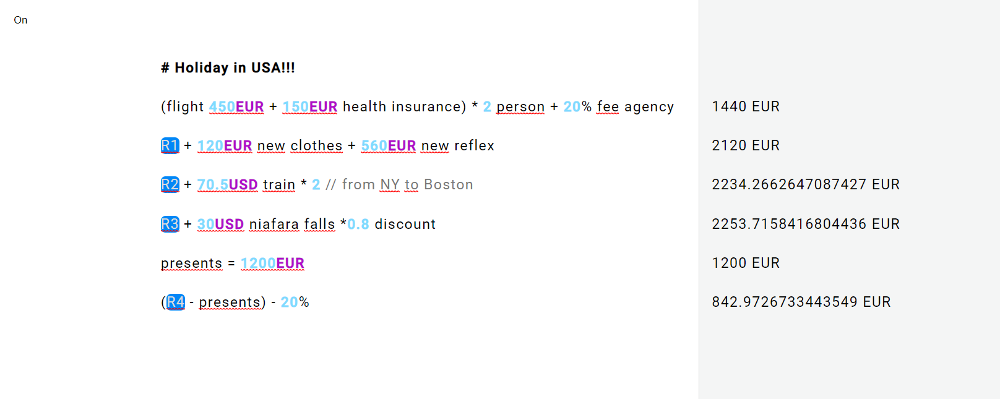

# SOULVER-WEB

A basic remake for the web of the [Soulver App](https://www.acqualia.com/soulver/) for Mac, made for studying purposes. I've always been fascinated by spreadsheets bindings and the interpretation of sentences written in natural language and soulver-web is my effort in Vanilla Javascript to combine these two inputs. Just type in the white blackboard and the math operations will produce results in the grey right column.

## Features and TODOs
- [x] Basic styling for numbers, currencies, comments (by writing `// xxxxxx..`) and bold headers (by writing `# xxxxx..`)
- [x] expressions parsing, math functions and operations thanks to [math.js](https://mathjs.org/)
- [x] SI Notation: `k` for thousands, `M` for millions
- [x] Inline variables declared using the equals sign
- [x] currencies (right now `EUR`, `USD` and `GBP` are supported) 
- [x] binding with rows results (by writing `R and rownumber` or by pressing `+` in a blank new row) with auto update
- [x] writing `total` in a blank new row sums the previous results (with auto update)
- [ ] Unit Conversions
- [ ] Calendar math
- [ ] Percentages expressed with natural functions
- [ ] Number formatting
- [ ] Import in .json and save in .txt/.json format
- [x] Black theme

## Demo
To test things locally just serve the root with a web server or [check the app online](https://festive-lalande-0b44f6.netlify.com/)

## Bugs
- Uhm, many...!

## License
This project is licensed under the ISC License.