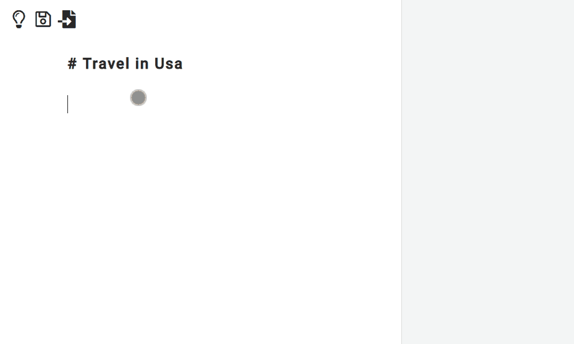

# SOULVER-WEB

A basic remake for the web of the [Soulver App](https://www.acqualia.com/soulver/) for Mac, made for studying purposes. I've always been fascinated by spreadsheets bindings and the interpretation of sentences written in natural language and SOULVER-WEB is my effort in Vanilla Javascript to combine these two inputs. Just type in the left blackboard and the math operations will produce results in the right column.

## Features and TODOs
- [x] Basic styling for numbers, currencies, comments (by writing `// xxxxxx..`) and bold headers (by writing `# xxxxx..`)
- [x] expressions parsing, math functions and operations thanks to [math.js](https://mathjs.org/)
- [x] SI Notation: `k` for thousands, `M` for millions
- [x] Inline variables declared using the equals sign
- [x] Currencies: thanks to [exchangeratesapi](https://exchangeratesapi.io/) it's possible to have daily rates for 32 [currencies](https://www.ecb.europa.eu/stats/policy_and_exchange_rates/euro_reference_exchange_rates/html/index.en.html) and convert them with the`xxEUR in USD` pattern.
- [x] binding with rows results (by writing `R and rownumber` or by pressing `+` in a blank new row) with auto update
- [x] writing `subtotal` in a blank new row sums the previous results in the set (with auto update)
- [x] writing `total` in a blank new row sums all the previous results (with auto update)
- [ ] Unit Conversions
    - [x] Length/Distance: mm,cm,m,km
    - [x] Mass/Weight: mg,g,kg
    - [ ] Area: cm2,m2,km2,ha
    - [ ] Time:
    - [ ] Volume: cm3,m3,ml, l
- [ ] Calendar math
- [x] Percentages expressed with natural functions 
    - [x] 10% of 20
    - [x] var +/- 20%
    - [ ] var as a % of var
- [ ] Number formatting
- [x] Import and export sheets in .json format
- [x] White/Black themes
- [x] Take notes by using voice-to-text with the [HTML5 Web Speech API](https://developer.mozilla.org/en-US/docs/Web/API/Web_Speech_API)

## Demo
[check the app online](https://festive-lalande-0b44f6.netlify.com/) or to test things locally just install dependancies with `npm i`and run the local development environment with `npm start`.  SVG Icons courtesy from [svgicons.sparkk](http://svgicons.sparkk.fr/) and sound courtesy from [soundbible](http://soundbible.com/).

## Bugs
- Uhm, many...!

## License
This project is licensed under the ISC License.